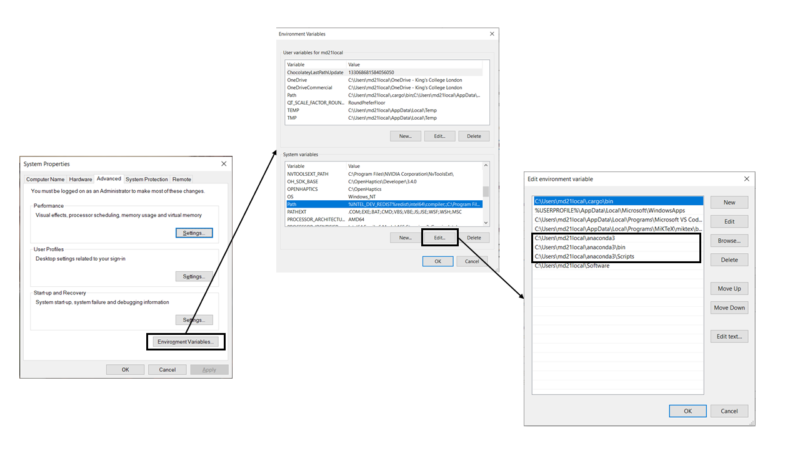

# Python-VSCode :snake:

This file contains information on how to install and handle different Python versions using miniconda. Additionally, we discuss a short introduction on how to set up the **Visual Studio Code (VSCode)** IDE to use Python efficiently.

## Miniconda3

[Miniconda3](https://docs.conda.io/en/latest/miniconda.html) is a free minimal installer for conda. It is a small, bootstrap version of **Anaconda** that includes only conda, Python, its dependencies and few other useful packages (pip, zlib, etc.). 

For Linux, I recommend installing Miniconda using the terminal, as it will simplify the process of browsing and you can directly copy paste from here :wink:. Open a terminal and type the following commands:

```shell
echo "export PATH=/home/${USER}/miniconda3/bin:$PATH" >> ~/.bashrc
wget https://repo.anaconda.com/miniconda/Miniconda3-latest-Linux-x86_64.sh
bash Miniconda3-latest-Linux-x86_64.sh -b
rm -f Miniconda3-latest-Linux-x86_64.sh
eval "$(/home/${USER}/miniconda3/bin/conda shell.bash hook)"
conda init
```
If the steps were correctly followed you should see that in your terminal in front of the command line `(base)`. This represents that you are using the *base* environment from Miniconda. You can check this by running:

```shell
which python
/home/yourUser/miniconda3/bin/python3
```

For Windows, download the installer from the official webpage. You can find the latest version [here](https://docs.conda.io/en/latest/miniconda.html). Once installed we need some additional work to use **conda** in our PowerShell terminal. First, we need to add the Miniconda scripts and libraries into the system *PATH*, here is how you do it:
> 1. Click the Windows button and look for *Edit the system environmnet variable*.
> 1. In the new Window click in *Environment Variables...*
> 1. In your environment variables find the *Path* variable and click on *Edit...*
> 1. In the new window, click in *Browse* and add the following 3 directories:
>       * C:\Users\yourUser\miniconda3
>       * C:\Users\yourUser\miniconda3\bin
>       * C:\Users\yourUser\miniconda3\Scripts



Now we need to run a **PowerShell (PS)** terminal as administrator. If we try to run the command `conda init` we will still have the following error. 

```powershell
File C:\Users\User\Documents\WindowsPowerShell\profile.ps1 cannot be loaded because running scripts is
    disabled on this system. For more information, see about_Execution_Policies at
    https:/go.microsoft.com/fwlink/?LinkID=135170.
    At line:1 char:3
    + . 'C:\Users\BinoyGhosh\Documents\WindowsPowerShell\profile.ps1'
    +   ~~~~~~~~~~~~~~~~~~~~~~~~~~~~~~~~~~~~~~~~~~~~~~~~~~~~~~~~~~~~~
        + CategoryInfo          : SecurityError: (:) [], PSSecurityException
        + FullyQualifiedErrorId : UnauthorizedAccess
```

In this terminal, type the following command `set-executionpolicy remotesigned`. Now `conda init` should execute without any problem. You should see the same as in *Linux* with the word `(base)` at the beginning of your command line. You can additionally run `where python` to check that the python you are using is actually the one from **miniconda3**.

## Create different conda environments

In this step the steps and commands are the same for both OS *Linux* and *Windows*. The main difference is that for *Windows* you will need to use the **PowerShell** terminal. In this example, I will show you how to setup two different environments one running with *Python 3.9* and a second using *Python 3.11*. For this, we will use the command `conda create`.

```console
conda create -n py3_9 python=3.9 -y
conda create -n py3_11 -c conda-forge python=3.11 -y
```

The environments will be created into the *envs* folder under the **root** miniconda3 directory. To use one of the newly created environments we can run the command `conda activate py3_9`. Now in the place where we had `(base)`, we should see `(py3_9)`. From no one, we won't need to explicitly activate the environment as **VSCode** does it for us.

## Setup Visual Studio Code

For Linux, as you have probably observed during this tutorial we love the terminal. So, we are installing VSCode using this great tool. You can find more information and other installing methods on the official [website](https://code.visualstudio.com/docs/setup/linux). Here are the commands to install **VSCode**:

```shell
sudo apt-get install wget gpg
wget -qO- https://packages.microsoft.com/keys/microsoft.asc | gpg --dearmor > packages.microsoft.gpg
sudo install -D -o root -g root -m 644 packages.microsoft.gpg /etc/apt/keyrings/packages.microsoft.gpg
sudo sh -c 'echo "deb [arch=amd64,arm64,armhf signed-by=/etc/apt/keyrings/packages.microsoft.gpg] https://packages.microsoft.com/repos/code stable main" > /etc/apt/sources.list.d/vscode.list'
rm -f packages.microsoft.gpg
sudo apt install apt-transport-https
sudo apt update
sudo apt install code # or code-insiders
```

For Windows, simply download the installer from the official [website](https://code.visualstudio.com/docs/setup/windows). Execute the installer and follow the instructions on the program.

Open **VSCode** and configure the layout to your liking. We can now create a folder that we are gonna name *test-vs-python* for example. We open this project in our **VSCode** session and we create a new file *main.py*. Once we have finished created it, a pop up should appear on the bottom-right part of your screen to download the recommended extension for *Python*. If this did not appear we can find it under the *Extension (Ctrl+Shift+X)* window on the left bar. We type **Python** and we download the recommended extension. Now we can control our python interpreter for the project and use the built-in terminal to install new packages.

To choose the project Python interpreter we click *Ctrl+Shift+P* to open the function finding bar. In this bar look for **Python: Select Interpreter**. This should list all the available *Python* distributions on our system. We choose the one we have created previously for *Python 3.9*. It should appear as follow: 
> Python 3.9.x ('py3_9': conda) ~\miniconda3\envs\py3_9\python.exe

To check that the selection was succesful, Open a new terminal using *Ctrl+Shift+'*. You should see the keyword `(py3_9)` at the beginning of your command line.

Let's program a bit in python and add new packages to our project, just for fun. Open the created file *main.py* and write the following code.

```python
# main.py
import numpy as np

my_array = np.random.randint(0, 100, 1)
print(my_array)
```
This program will generate a random integer between 0 and 100. But, we depend on the [*numpy*](https://numpy.org/doc/stable/index.html) packages which is not available between the pre-install packages on **miniconda3**. To install the package simply, open a terminal *(Ctrl+Shift+')* and type: `pip install numpy`. This should automatically install *numpy* into your conda environment packages. You can check this by running `pip list` and *numpy* should appear between the installed packages. Now, we can run the program without any error and additionally we will have access to the documentation and the autocomplete of our code :astonished:!


## Including external packages

Sometimes we will want to have access to external projects from different *python* projects, that are not part of [**PyPi**](https://pypi.org/). For this we will need to create a *settings.json* file, that will configure and extend the path that our *IntelliSense* has access to. To create this *settings.json* file, open the function bar *(Ctrl+Shift+P)*, now find **Preferences: Open Workspace Settings (JSON)**. If this is the first time you use this function it will create a new folder on your project directory (check in the left hand bar) named as *.vscode*. Inside this folder you should find the *settings.json* file. That it should like this:

```json
{
}
```

Good! Now is time to add our library to the extended path for the autocomplete and function documentation. For this we just need to add the following line to the *settings.json* file.

**Linux**
```json
{
    "python.analysis.extraPaths": [
        "/home/$USER/pathToExternalPackage"
    ]
}
```

**Windows**

```json
{
    "python.analysis.extraPaths": [
        "C:\Users\yourUser\pathToExternalPackage"
    ]
}
```