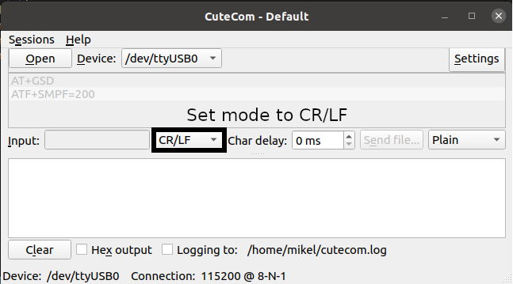

# Force sensor

This file contains the commands to activate the serial port to read the 6-axial Force/Torque sensor.

## Initial activation

To activate the serial connection with the sensor we will use the cutecom software for a more user friendly command sender. To install *cutecom* in Linux use the following commands.

```
$ sudo apt-get update
$ sudo apt-get install cutecom lrzsz
```

Validate the installation running the `$ cutecom` command on the Linux terminal. Once the GUI is opened, find the serial port corresponding to the sensor that should look like the following */dev/ttyUSB_* where the underscore represents any number.

Click the Open button and in the input area make sure you set the the input mode to CR/LF in the sliding window (look at the image below) . More info on the commands can be found [here]().

> AT+SMPF=200
>  
> AT+GSTD

*AT+GSTD* restarts the data stream exchange with the serial port. *AT+SMPF* defines thesample frequency for the serial port.